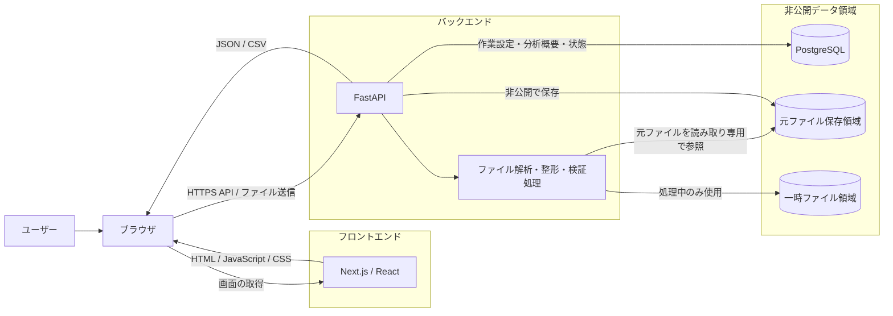
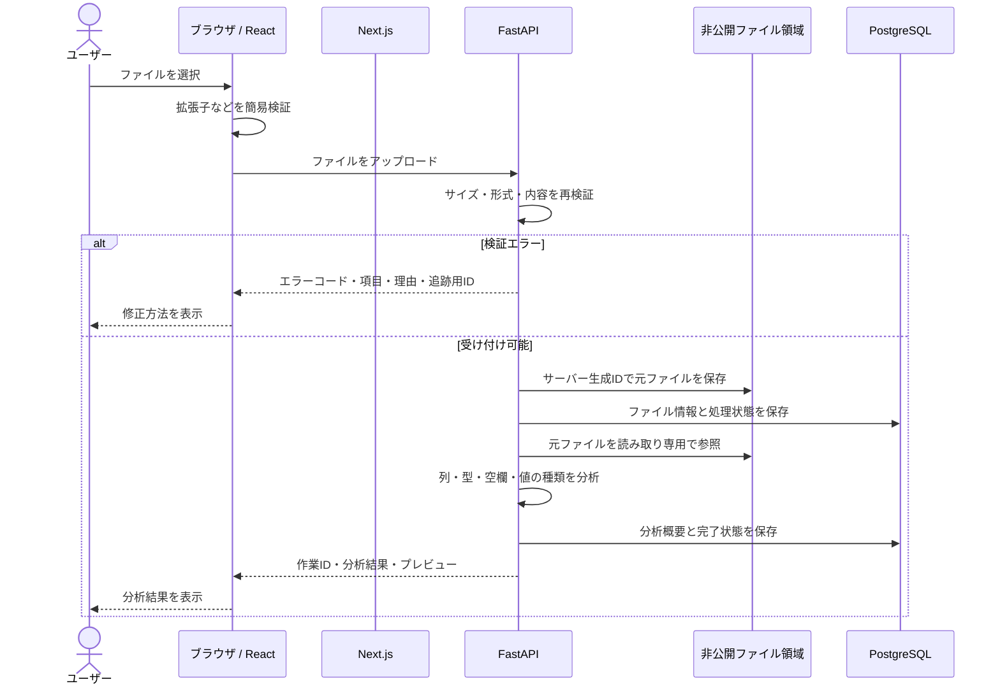
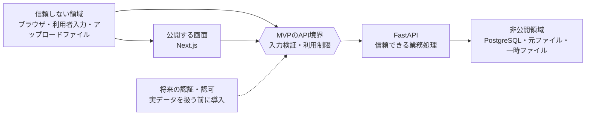
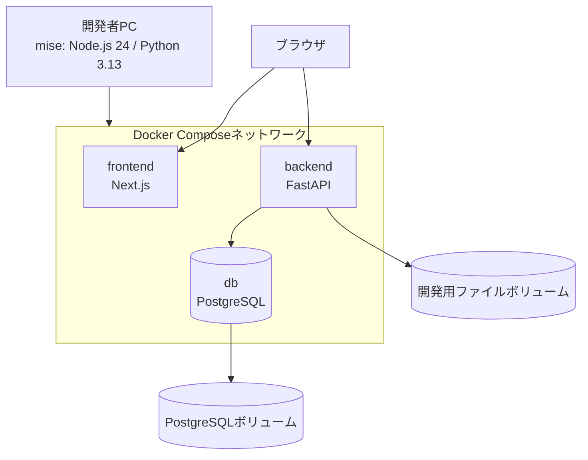

# データ移行支援Webアプリ システム構成・ディレクトリ設計

## 1. この文書の目的

この文書は、`docs/product-requirements.md`で定義したMVPを実装するために、システム全体の構成、各コンポーネントの責務、データの流れ、保存方針、セキュリティ境界、推奨ディレクトリ構成を整理するものである。

現時点では設計方針だけを定める。Next.js、FastAPI、PostgreSQL、Docker Composeなどのセットアップ、ライブラリの選定、APIやデータベースの詳細設計は、対応する実装タスクの開始前に改めて確認する。

## 2. 設計の基本方針

- ブラウザは表示と操作を担当し、データ変換の正しさを保証する処理はFastAPIへ集約する。
- Next.jsとFastAPIの責務を分け、フロントエンドからPostgreSQLやファイル保存領域へ直接アクセスさせない。
- アップロードされたファイルは信頼できない入力として扱い、バックエンドで必ず検証する。
- 元ファイルは書き換えず、分析結果、変換設定、出力結果を元ファイルとは別に管理する。
- 同じ元データと同じ設定から、同じ結果を再現できる構成にする。
- 本番データベースへの直接投入は行わず、MVPの出力はテーブル別CSVまでとする。
- 個人情報や機密情報を必要以上に保存、表示、記録しない。
- 実装は`docs/product-requirements.md`の開発マイルストーンに沿って、小さな単位で進める。

## 3. システム全体の構成

MVPは、ブラウザ、Next.js、FastAPI、PostgreSQL、バックエンド専用のファイル保存領域で構成する。



### 3.1 ブラウザ

- Next.jsが配信した画面を表示する。
- ファイル選択、設定入力、分析結果の確認、CSVダウンロードなどのユーザー操作を受け付ける。
- FastAPIへAPIリクエストを送る。
- PostgreSQLやサーバー上のファイルへ直接アクセスしない。

### 3.2 Next.js

- Reactによる画面、ルーティング、画面状態を管理する。
- FastAPIのレスポンスをユーザーが理解できる形で表示する。
- 入力時の簡易的な検証を行い、明らかな入力ミスを早期に通知する。
- データ分析、整形、検証、重複判定、CSV生成の正しさは保証しない。

### 3.3 FastAPI

- ブラウザから受け取るすべての入力を検証する。
- Excel・CSVの読み取り、分析、整形、検証、重複候補の検出、CSV生成を実行する。
- 元ファイル、一時ファイル、PostgreSQLへのアクセスを管理する。
- 処理結果をJSONまたはダウンロード用CSVとして返す。
- 業務ルールとセキュリティ上の最終的な判断を行う。

### 3.4 PostgreSQL

- 変換作業の基本情報と処理状態を保存する。
- ファイルの識別子、メタデータ、保存先を示す内部参照、チェックサムを保存する。
- 分析結果の概要、出力先定義、列の対応付け、整形ルール、検証ルールを保存する。
- 元のExcel・CSVや一時ファイルそのものは保存しない。

### 3.5 ファイル保存領域

- 元ファイルと一時ファイルを、Webから直接公開されない場所へ保存する。
- 実ファイル名にはユーザーが送信したファイル名をそのまま使用せず、サーバーが生成した識別子を使用する。
- 元ファイル用と一時ファイル用の領域を分け、異なる削除方針を適用できるようにする。

## 4. ブラウザ、Next.js、FastAPI、PostgreSQL間のデータの流れ

### 4.1 画面表示

1. ブラウザがNext.jsへ画面を要求する。
2. Next.jsがHTML、JavaScript、CSSを返す。
3. ブラウザ上のReactが画面操作を管理する。

### 4.2 API操作

1. ブラウザがユーザーの操作に応じてFastAPIへリクエストを送る。
2. FastAPIがリクエスト形式、入力値、対象リソースを検証する。
3. FastAPIが必要に応じてファイルを処理し、PostgreSQLから設定を読み書きする。
4. FastAPIが成功結果または構造化されたエラーを返す。
5. ブラウザが結果を画面へ反映する。

### 4.3 データアクセスの制約

- Next.jsとブラウザは、PostgreSQLへ直接接続しない。
- ブラウザへ、サーバー内部のファイルパスやデータベース接続情報を返さない。
- FastAPIだけが、PostgreSQLと非公開ファイル領域へアクセスする。
- PostgreSQLにはFastAPIからのみ接続し、ローカル開発で必要な場合を除いて外部へ公開しない。

## 5. フロントエンドとバックエンドの責務

| 対象 | フロントエンドの責務 | バックエンドの責務 |
| --- | --- | --- |
| ファイル選択 | 選択状態、拡張子、未選択などを早期に通知する | 実際のファイル形式、サイズ、内容、読み取り可否を検証する |
| アップロード | 進行状態と成功・失敗を表示する | 安全なファイル名で保存し、メタデータと処理状態を管理する |
| データ分析 | 分析結果、プレビュー、注意事項を表示する | ファイルを読み取り、型推定や空欄数などを計算する |
| 整形・検証設定 | 設定フォームと入力補助を提供する | 設定を再検証し、変換と業務上の検証を実行する |
| 重複確認 | 候補を比較し、ユーザーの選択を受け付ける | 指定列から完全一致の候補を検出し、選択内容を再検証する |
| 出力先定義 | テーブルや列の設定画面を提供する | 定義の整合性を検証し、テーブル別CSVを生成する |
| エラー表示 | ユーザー向けメッセージと修正箇所を表示する | エラーを分類し、安全な形式で詳細と追跡用IDを返す |
| 状態保存 | 保存操作と保存状態を表示する | PostgreSQLへ整合性を保って保存する |

## 6. Excel・CSVのアップロードから分析結果表示までの流れ



### 6.1 処理上の注意

- アップロードは一度に一ファイルとする。
- ファイル全体を無条件にメモリへ読み込まず、サイズ上限を検査しながら安全に受け取る。
- 拡張子だけで形式を判断せず、ファイルの内容も検証する。
- `.xlsx`は内部的に圧縮ファイルであるため、展開後のサイズやファイル数が過大にならないように検証する。
- CSVの文字コードや区切り文字の推定結果は、確定値ではなくユーザーが確認できる情報として返す。
- 分析処理に失敗した場合は、処理状態を失敗として記録し、作成済みの不要な一時ファイルを削除する。

## 7. データの保存方針

| データ | 保存先 | 保存内容 | 基本方針 |
| --- | --- | --- | --- |
| 元ファイル | 非公開ファイル領域 | アップロードされた`.xlsx`またはCSV | 書き換えず、サーバー生成IDで保存する。保持期限までは再分析の基準とする |
| ファイル情報 | PostgreSQL | 元の表示名、内部識別子、サイズ、形式、チェックサム、処理状態 | サーバー内部の絶対パスはAPIレスポンスへ含めない |
| 一時ファイル | 非公開の一時領域 | 解析中の展開データ、生成途中のCSVなど | 処理完了時または失敗時に削除し、残存時に備えて期限による削除も行う |
| 分析結果 | PostgreSQL | 列情報、型推定、空欄数、値の種類数、問題件数などの概要 | 全セルの複製を避け、再利用に必要な概要を保存する |
| プレビューデータ | APIレスポンス、必要に応じて短期保存 | 画面表示に必要な一部の行 | 表示量を制限し、元ファイルから再生成できるようにする |
| 作業設定 | PostgreSQL | 出力先定義、列対応、整形ルール、検証ルール、重複確認結果 | 作業単位で整合性を保ち、秘密情報を含めない |
| 出力CSV | 一時ファイル領域 | テーブル別に生成したCSV | 同じ入力と設定から再生成し、ダウンロード後も無期限には保存しない |

### 7.1 元ファイルを不変にする理由

元データが変わると、変換前後の比較や処理結果の再現ができなくなる。そのため、整形や重複候補の選択では元ファイルを直接編集せず、設定と処理結果を別に管理する。

### 7.2 PostgreSQLへファイル本体を保存しない理由

ファイル本体と作業設定では、容量、アクセス方法、削除方針が異なる。PostgreSQLには検索や整合性管理が必要なメタデータと設定を保存し、ファイル本体は非公開ファイル領域で管理することで責務を分ける。

### 7.3 保持期限

具体的な保持期間は実装前に決定する。MVPでも、元ファイル、失敗した処理、一時ファイル、出力CSVについて削除時期を区別し、期限切れデータを削除できる構造にする。

## 8. APIの基本方針

- APIはFastAPIで提供し、パスにはバージョンを含める。例として`/api/v1`を使用する。
- 作業、ファイル、分析、出力先定義、変換設定、CSV出力などをリソースとして扱う。
- 通常の送受信にはJSON、ファイルアップロードには`multipart/form-data`、CSVダウンロードには適切なContent-Typeを使用する。
- APIの入出力は型を定義し、FastAPIが生成するOpenAPI仕様と実装を一致させる。
- 日時はタイムゾーンを明確にし、API内部では一貫した形式で扱う。
- リソースの識別子には、連番をそのまま外部公開する方式を避け、推測されにくいIDを使用する。ただし、推測されにくいIDは認可の代わりにならない。
- 一覧やプレビューでは返却件数に上限を設け、必要に応じてページ分割する。
- APIレスポンスへ、サーバー内部のパス、スタックトレース、秘密情報を含めない。
- MVPでは本番データベースへの直接投入APIを作成しない。

### 8.1 APIの代表的な処理単位

以下は責務を示すための例であり、確定したエンドポイント一覧ではない。

- 変換作業の作成、取得、更新
- 元ファイルのアップロードとファイル情報の取得
- ファイル分析の開始、状態確認、結果取得
- 整形・検証ルールの保存と適用
- 重複候補の取得と採用行の保存
- 出力先テーブル定義の保存
- テーブル別CSVの生成とダウンロード

詳細なURL、HTTPメソッド、リクエスト、レスポンスは、各マイルストーンの実装前にAPI設計として確定する。

## 9. 入力値検証の責務

### 9.1 フロントエンド

- ユーザーが入力時に問題へ気づけるように、必須入力、文字数、選択状態、明らかな形式不正などを簡易的に検証する。
- ファイル選択時に、未選択、拡張子、ブラウザから取得できるファイルサイズなどを確認する。
- エラー箇所と修正方法を、操作中の画面に分かりやすく表示する。
- フロントエンドの検証は操作性を高めるためのものであり、データの安全性や正しさを保証するものではない。

### 9.2 バックエンド

- バックエンドの検証結果を、システムにおける信頼できる基準とする。
- フロントエンドの検証を通過したことを信用せず、APIが受け取るすべての入力を必ず再検証する。
- APIの型、必須項目、文字数、値の範囲、列の組み合わせ、参照先の存在、処理状態を検証する。
- ファイルの拡張子、サイズ、内容、読み取り可否、展開後の規模を検証する。
- 出力先定義、整形ルール、検証ルール、重複候補の選択が対象の作業と整合することを検証する。
- 不正な入力は処理や保存の前に拒否し、ユーザーが原因を判断できるエラーを返す。

### 9.3 検証の重複

フロントエンドとバックエンドで同じ条件を検証する場合がある。この重複は、フロントエンドで早く問題を伝え、バックエンドで安全性とデータ整合性を守るために必要である。セキュリティ上必要な検証の重複は許容し、処理を省略する理由にはしない。

### 9.4 データベース

PostgreSQLでも、NOT NULL、UNIQUE、外部キー、CHECK制約など、データの整合性を守るために適切な制約を設ける。データベース制約はバックエンドの検証を置き換えるものではなく、最後の防御として使用する。

## 10. エラー処理の責務

### 10.1 バックエンドのエラー分類

- **入力エラー**: 必須項目不足、形式不正、許可されない値など
- **ファイルエラー**: 未対応形式、サイズ超過、破損、読み取り失敗など
- **業務ルールエラー**: 存在しない列の指定、矛盾する設定、無効な処理順序など
- **競合エラー**: 古い状態に対する更新、すでに完了または削除された作業への操作など
- **システムエラー**: 予期しない処理失敗、データベース接続失敗など

### 10.2 APIエラーの形式

APIは、少なくとも次の情報を持つ一貫したエラー形式を返す。

- アプリ内で分類できるエラーコード
- ユーザー向けの安全なメッセージ
- 入力項目や行・列を特定するための情報
- ログと対応付けるための追跡用ID

元データの行全体、秘密情報、サーバー内部のパス、スタックトレースは返さない。

### 10.3 フロントエンドの表示

- 入力欄で修正できるエラーは、対象欄の近くに表示する。
- ファイル全体や処理全体のエラーは、画面上部など見つけやすい場所に表示する。
- 再試行できるエラーと、設定やファイルの修正が必要なエラーを区別する。
- 不明なエラーを成功として扱わず、追跡用IDとともにユーザーへ通知する。

### 10.4 ログ

- 追跡用ID、処理種別、状態、処理時間など、調査に必要な最小限の情報を記録する。
- アップロードファイルの中身、行全体、APIキー、パスワード、接続情報は記録しない。
- 予期しないエラーはサーバー側で原因を確認できるように記録し、ブラウザには安全なメッセージだけを返す。

## 11. セキュリティ上の境界



### 11.1 ブラウザとAPIの境界

- ブラウザから送られる値は、画面上で生成した値であっても信頼しない。
- MVPでは認証・認可を実装せず、API境界では入力検証と利用制限を行う。開発、テスト、デモには架空のサンプルデータだけを使用する。
- CORSはアクセス制御や認証の代わりにならない。許可するオリジンを必要最小限に限定する。
- 公開時はHTTPSを必須とし、通信途中でファイルや設定が読み取られないようにする。
- 推測されにくいIDを使用しても、アクセス権を確認する認可の代わりにはならない。
- 実データを扱う前に認証・認可を導入し、作業やファイルごとにアクセス権を確認する。

### 11.2 アップロードファイルと処理の境界

- ファイル名を保存先パスとして信用せず、パストラバーサルを防ぐ。
- ファイルサイズ、処理時間、展開後サイズ、行数、列数に上限を設け、過剰なリソース消費を防ぐ。
- ファイルは実行せず、解析に必要なデータだけを読み取る。
- CSVの出力値が表計算ソフトで数式として解釈される危険性を考慮する。

### 11.3 APIと非公開データ領域の境界

- PostgreSQLとファイル保存領域へアクセスできるのはFastAPIだけとする。
- データベース接続情報などは環境変数で渡し、コードやGitへ含めない。
- アプリケーションの権限は必要最小限とし、本番データベースへの接続権限を与えない。
- 元ファイルと出力ファイルは公開ディレクトリへ配置せず、APIによる確認を経て提供する。

## 12. ローカル開発環境での構成

ローカル開発では、miseでNode.js 24とPython 3.13のバージョンを揃え、Docker ComposeでNext.js、FastAPI、PostgreSQLを同じ手順で起動できる構成を想定する。



### 12.1 想定するサービス

- `frontend`: Next.js開発サーバー
- `backend`: FastAPI開発サーバー
- `db`: PostgreSQL

### 12.2 ローカル環境の注意点

- ブラウザからアクセスするポートだけをホストへ公開する。
- PostgreSQLのポート公開が必要な場合はローカルホストに限定する。
- 元ファイル用の開発ボリュームとPostgreSQLのデータボリュームを分ける。
- サンプルの環境変数は`.env.example`へ記載し、実際の値を持つ`.env`はコミットしない。
- 開発、テスト、デモには架空のサンプルデータだけを使用する。
- Docker Composeの具体的なサービス定義は、セットアップタスクで確認してから作成する。

## 13. 将来公開する場合の構成上の注意点

- Next.jsとFastAPIの前段にHTTPSを終端する公開入口を置き、同一オリジン配下で画面とAPIを提供する構成を優先する。
- 実データを扱う前に認証と認可を追加し、作業、ファイル、出力結果を所有者以外が参照できないようにする。
- FastAPIは状態をローカルディスクだけに持たず、複数インスタンスから参照できるオブジェクトストレージなどを検討する。
- PostgreSQLは外部公開せず、暗号化、バックアップ、復元手順、接続数制限を設定する。
- ファイル保存領域では暗号化、保持期限、削除処理、アクセス記録を設定する。
- ファイルサイズ、リクエスト回数、処理時間を制限し、サービス拒否につながる過剰な利用を防ぐ。
- 分析に時間がかかる場合は、APIリクエスト内で待ち続けず、バックグラウンド処理と状態確認方式を検討する。
- アップロードファイルのマルウェア検査が必要か、扱うデータと公開範囲に応じて判断する。
- ログ、メトリクス、エラー監視を導入する場合も、元データや秘密情報を外部サービスへ送信しない。
- データの保存地域、保持期間、削除要求への対応など、組織の規程と適用法令を確認する。
- 自動デプロイはMVPの対象外であり、公開方法を決定した時点でリリース手順と権限管理を別途設計する。

## 14. ディレクトリ構成の比較

### 14.1 案A: `frontend / backend`

```text
repository/
├── frontend/
├── backend/
├── docs/
├── compose.yaml
├── mise.toml
└── .github/
```

**利点**

- Next.jsとFastAPIの技術境界が名前から分かる。
- 今回のようにWeb画面とAPIが一つずつの構成では、目的のファイルへ直接たどり着きやすい。
- 特定のモノレポ管理ツールを前提にせず、Node.jsとPythonを独立して管理しやすい。
- 初期段階で不要な階層や共有パッケージのルールを増やさずに済む。

**注意点**

- 将来、複数のWebアプリ、バッチ、共通パッケージが増えると、ルート直下の役割が増える。
- 共有コードを置く場所は、必要になった時点で別途設計する必要がある。

### 14.2 案B: `apps/web / apps/api`

```text
repository/
├── apps/
│   ├── web/
│   └── api/
├── packages/
├── docs/
├── compose.yaml
├── mise.toml
└── .github/
```

**利点**

- 複数の実行可能アプリを`apps`へ、共有物を`packages`へ分類できる。
- 将来、管理画面、バッチ、共有UI、生成したAPIクライアントなどが増える場合に拡張しやすい。
- アプリ数が増えても、リポジトリ直下を整理しやすい。

**注意点**

- 現時点では`apps`の下に2つしかなく、階層と命名ルールが先に増える。
- TypeScriptとPythonを同じ`apps`配下で扱うため、各ツールの適用範囲を明確に設定する必要がある。
- 共通パッケージがまだ存在しない段階で`packages`を用意すると、用途のない構造になりやすい。

### 14.3 採用案

MVPでは、**案Aの`frontend / backend`構成を採用する**。

理由は、実行するアプリがNext.jsとFastAPIの2つであり、技術境界と責務をそのままディレクトリ名で示せるためである。現時点で共通パッケージや複数アプリの要件はなく、`apps / packages`による追加の階層と運用ルールを導入する利点は小さい。

将来、3つ以上の独立したアプリ、複数アプリで共有するパッケージ、リポジトリ全体を統合管理する必要が生じた場合は、`apps / packages`構成への移行を再検討する。

## 15. 推奨ディレクトリ構成

以下は役割と配置方針を示す案であり、この文書の作成時点ではディレクトリや設定ファイルを作成しない。

```text
data-cleaning-app/
├── frontend/
│   ├── src/
│   │   ├── app/                 # Next.jsのページとルーティング
│   │   ├── components/          # 複数機能で使う表示部品
│   │   ├── features/            # アップロード、分析など機能単位のコード
│   │   ├── lib/
│   │   │   └── api/             # FastAPIとの通信処理
│   │   └── types/               # フロントエンドで使う型
│   ├── tests/                    # 画面・機能のテスト
│   ├── public/                   # 公開してよい静的ファイル
│   └── package.json
├── backend/
│   ├── app/
│   │   ├── main.py              # FastAPIアプリの入口
│   │   ├── api/
│   │   │   └── routes/          # HTTPリクエストとレスポンス
│   │   ├── core/                # 設定、共通エラー、セキュリティ
│   │   ├── schemas/             # API入出力の型と検証
│   │   ├── services/            # 分析、整形、検証、CSV生成
│   │   ├── models/              # SQLAlchemyモデル
│   │   ├── repositories/        # データベース操作
│   │   └── db/                  # 接続とセッション管理
│   ├── migrations/              # Alembicマイグレーション
│   ├── tests/                   # API・サービス・DBのテスト
│   └── pyproject.toml
├── docs/
│   ├── product-requirements.md
│   └── system-architecture.md
├── sample-data/                 # 架空のデモデータだけを配置
├── .github/
│   └── workflows/               # テスト、lint、型チェックのCI
├── compose.yaml                 # ローカル開発用サービス定義
├── mise.toml                    # Node.jsとPythonのバージョン
├── .env.example                 # 秘密値を含まない環境変数の例
├── .gitignore
└── README.md
```

### 15.1 配置ルール

- `frontend/src/app`にはページ構成を置き、複雑な処理をページファイルへ集中させない。
- アップロード、分析、整形など特定機能に閉じる画面と状態は`features`へまとめる。
- `components`は複数機能で再利用する表示部品に限定する。
- FastAPIのルートはHTTP固有の処理に集中し、分析や変換の処理を`services`へ分ける。
- `schemas`はAPI境界の入力値検証、`models`はデータベースの永続化を表し、同じクラスを兼用しない。
- `repositories`はデータベース操作を隠し、`services`がSQLへ直接依存しすぎないようにする。
- 元ファイルや一時ファイルを`public`、`sample-data`、Git管理下へ保存しない。
- 実装開始時に必要な最小限のディレクトリだけを作り、空の階層を一括作成しない。

## 16. 主な設計判断と理由

| 設計判断 | 理由 |
| --- | --- |
| `frontend / backend`で分ける | 2つのアプリと技術境界を直接表し、現時点で不要なモノレポ階層を増やさないため |
| ブラウザからFastAPIへAPIリクエストを送る | Next.jsにファイル処理を重複させず、データ処理をFastAPIへ集約するため |
| バックエンドを検証結果の信頼できる基準とする | ブラウザ側の処理は回避・改変できるため、データ整合性と安全性を保証できないため |
| フロントエンドでも簡易検証する | ユーザーが入力時に問題へ気づき、不要な送信と待ち時間を減らせるため |
| セキュリティ上必要な検証の重複を許容する | 操作性と安全性は目的が異なり、フロントエンドの検証通過を信用できないため |
| 元ファイルを不変データとして保存する | 変換前後の比較、再分析、処理結果の再現に必要な基準を保つため |
| ファイル本体をPostgreSQLへ保存しない | ファイルと構造化データで、容量、アクセス、保持期限の責務を分けるため |
| 分析概要と作業設定をPostgreSQLへ保存する | 作業を再開し、設定と状態の整合性を管理できるようにするため |
| 出力CSVを再生成可能な一時成果物とする | 無期限の重複保存を避け、同じ入力と設定による再現性を確認するため |
| FastAPIだけがDBと非公開ファイルへアクセスする | データアクセス経路を限定し、検証と権限管理を一か所へ集約するため |
| 本番データベースへ直接接続しない | 誤更新や誤削除の影響を避け、人による出力確認を残すMVP方針に合わせるため |
| APIにバージョンを含める | 将来の変更時に既存の画面との互換性を管理しやすくするため |

## 17. 実装前に判断すべき未確定事項

以下は現時点で固定せず、該当するマイルストーンの実装前に、候補、利点、欠点、追加ライブラリの必要性を確認して決定する。

### 17.1 ファイル取込・分析前

- Excel・CSVを読み書きするPythonライブラリ
- 対応するCSV文字コード、区切り文字、改行コードの範囲
- ファイルサイズ、行数、列数、シート数、展開後サイズの上限
- 型推定の規則と、推定できるデータ型の種類
- プレビュー行数と、値の例を返す際のマスキング方針
- 分析を同期処理で行うか、ジョブとして非同期処理にするか
- 元ファイルと分析結果の具体的な保持期間

### 17.2 整形・検証前

- 欠損値、日付、真偽値、文字列の内部表現
- 整形ルールと検証ルールを保存するデータ構造
- ルールの実行順序と、複数ルールが競合した場合の扱い
- 行・列エラーのコード体系とAPIレスポンス形式

### 17.3 重複確認・CSV出力前

- 重複候補で採用しなかった行を、除外、保留、エラーのどれとして扱うか
- 出力テーブル間の関連を表すIDの生成方法
- CSVの文字コード、BOM、改行、引用符、NULL、日付、真偽値の出力形式
- CSV数式インジェクションへの具体的な対策と、値を変更した場合の表示方法
- 複数のCSVを個別に提供するか、一つのアーカイブにまとめるか

### 17.4 作業状態の保存前

- PostgreSQLのテーブル構造と、JSON型を使用する範囲
- 作業状態と分析処理状態の遷移
- 同時更新を検出する方法
- 元ファイルの削除と、関連する作業設定・分析結果の扱い
- ローカルファイル保存領域の具体的なパスと権限

### 17.5 UI・公開検討前

- Next.jsでサーバー側とクライアント側のどちらに置くかという画面ごとの境界
- OpenAPIからTypeScriptのAPI型やクライアントを生成するか
- ローカル開発でのオリジン、ポート、CORS設定
- 実データを扱う場合の認証、認可、利用者管理
- 公開時のホスティング先、オブジェクトストレージ、データベース
- マルウェア検査、レート制限、監視、バックアップ、障害復旧の要件
- アクセシビリティと対応ブラウザの基準
- 自動デプロイを導入するか、およびリリース承認の方法
